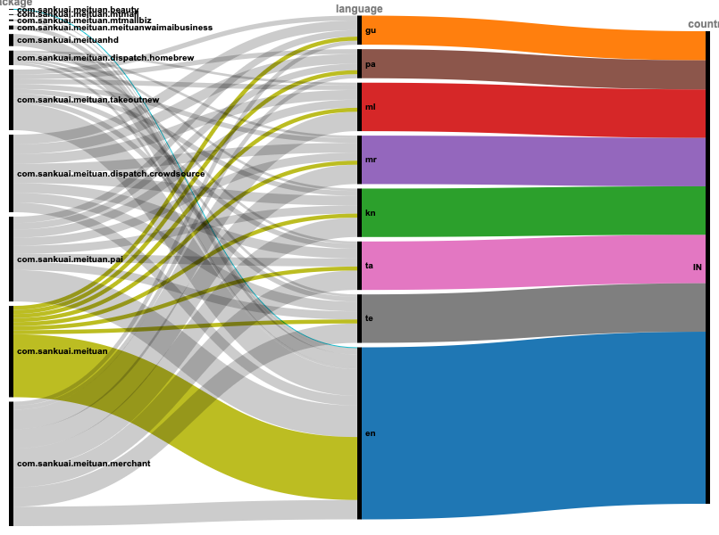
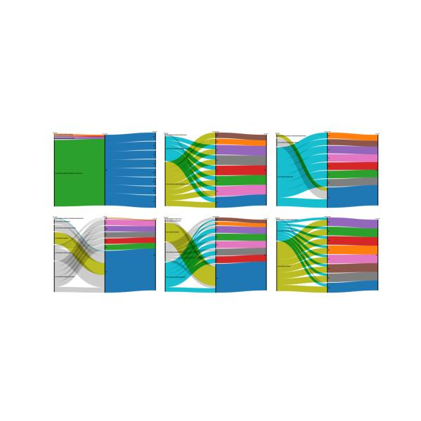

##  Language Presence in Apps

One way of using the localisation code is to create and use it to trace languages and apps over time. 

I used the localisation code to find the filenames that contain localisations patterns. 

Using some R an Python code yet to be released, I managed to extract the country nad languages. 

I filtered the data by country: in this case IN, or India, as it has a range of languages. 

This provides a nice broad view of the territry. The data can be broken down further. In this case, I broke it down by major version number of the app as extracted while reading the permission from the manifests. 

This offers many more different forms of reading that require further investigation. 